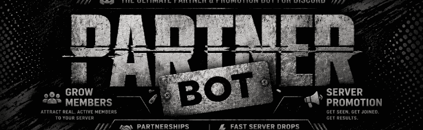
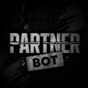

 
 

# Auto Partner Bot

### Free Discord advertising and automatic partnerships made simple.

**Advertise your Discord server across a growing partnership network that has already reached 10,000+ members.**

 

&nbsp;&nbsp;

## Grow your Discord community for free

Auto Partner Bot is a Discord partnership bot that helps server owners gain exposure without searching for partners or repeatedly reposting advertisements.

Create your listing once, then advertise it across eligible communities in the partnership network. Everything works directly inside Discord with no dashboard or website login.

### What you get

* Free server advertising across eligible Discord partnership channels
* A growing network that has already reached 10,000+ members
* Simple setup using slash commands, buttons, and forms
* Advertising reminders and community leaderboards
* Free Auto Ad access through votes
* Permanent lifetime Auto Ad for a one time payment of only **$5**

## Three ways to advertise

### 1. Manual advertising for free

Do not want to vote or pay? No problem. Advertise manually using a single button. It is completely free.

Set up your listing, run `/advertise`, and Auto Partner Bot sends it across the eligible partner network. When the cooldown ends, press the button again.

### 2. Auto Ad for free

Vote for Auto Partner Bot on the supported listing sites to unlock automatic advertising. Users can advertise multiple servers every **4 hours**, depending on their active vote access.

This gives you powerful automatic promotion while keeping the bot fully free.

### 3. Lifetime Auto Ad for only $5

Get the exclusive Auto Ad feature **permanently for life** with a one time payment of only **$5**.

No repeated voting. No subscription. No monthly payment. Pay once and keep lifetime access.

The price may increase in the future, so grab lifetime Auto Ad while it is still only **$5**.

To purchase, [join the support server](https://discord.gg/faaahhhh-842342468581195786) and create a ticket.

## How it works

1. [Invite Auto Partner Bot](https://discord.com/oauth2/authorize?client_id=1517257160273297562&permissions=8&scope=bot%20applications.commands) to your server.
2. Run `/setup` and enter your permanent server invite and description.
3. Run `/advertise` or press the advertising button to promote for free.
4. Vote for free Auto Ad access or purchase lifetime Auto Ad for $5.

If you do not select a partnership channel, the bot can create and configure one for you.

## Public commands

| Command | What it does |
|---|---|
| `/help` | Opens the command guide |
| `/setup` | Creates or manages your partnership listing |
| `/advertise` | Advertises your server across the partner network |
| `/reminder` | Configures advertising reminders |
| `/auto ad add` | Enables automatic advertising |
| `/auto ad remove` | Disables an automatic advertisement |
| `/auto ad list` | Shows your automatic advertisements |
| `/server leaderboard` | Shows the server rankings |
| `/user leaderboard` | Shows the user rankings |
| `/vote` | Shows voting links and vote perks |
| `/support` | Opens the official support server |

## Find Auto Partner Bot

* [Top.gg](https://top.gg/bot/1517257160273297562)
* [Discord Bot List](https://discordbotlist.com/bots/partner-bot)
* [Discord Me](https://discord.me/autopartnerbot)
* [Discordlist.gg](https://discordlist.gg/bot/1517257160273297562)

## Ready to grow your Discord server?

 
 

© FAAAHHHH. All rights reserved. Bot branding and promotional assets may not be reused without permission.

