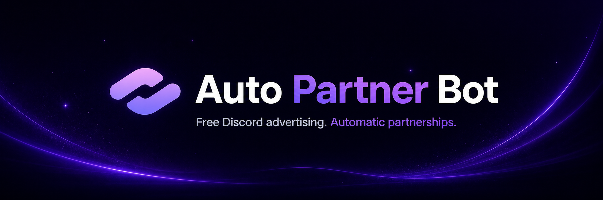

 
 

# Auto Partner Bot

### Free Discord advertising and automatic partnerships made simple.

**Keep your community visible across a partner network reaching more than 10,000 members—without repetitive promotion work.**

 

&nbsp;&nbsp;

## Grow your Discord community

Auto Partner Bot helps server owners reach new communities through a managed Discord partnership network. Create your listing once, advertise from Discord, and choose between free manual promotion, vote-powered Auto Ad access, or Premium slots.

### Why communities use it

* Advertise across eligible partnership channels from one place
* Set up and manage everything through clean Discord forms and buttons
* Keep your server visible every **4 hours** with Auto Ad access
* Let members advertise from ready-to-advertise reminders
* Set optional personal DM reminders for each user
* Track community and user rankings through leaderboards
* Use free vote slots or add two Premium slots for six months

## Choose how you advertise

### Manual advertising

Manual advertising is free. Once your server is set up, use `/advertise` whenever its cooldown has ended. The result panel includes quick access to Auto Ad and an optional personal reminder.

### Vote-powered Auto Ad

Each active vote on a supported listing site unlocks one temporary Auto Ad slot. Vote on both supported sites to unlock two slots, then manage eligible servers through `/auto ad list`.

### Premium Auto Ad

A **$5** purchase unlocks **two additional Auto Ad slots for six months**. Premium slots stack with active vote slots, allowing up to four assigned servers when both vote perks are active.

Run `/buy premium` or [join the support server](https://discord.gg/dmnw66HHmK) for help.

## Quick start

1. [Add Auto Partner Bot](https://discord.com/oauth2/authorize?client_id=1517257160273297562&permissions=8&scope=bot%20applications.commands) to your server.
2. Run `/setup`, choose the server type and advertisement channel, then submit your listing.
3. Use `/advertise` for free manual promotion.
4. Open `/auto advertise` to learn about Auto Ad access, or `/auto ad list` to manage enabled servers.

Reminder roles and reminder channels are optional. When permitted, the bot configures the selected channels with the access it needs and clearly reports any missing permissions.

## Public commands

| Command | What it does |
|---|---|
| `/help` | Opens the command guide |
| `/setup` | Creates a partnership listing and reminder preferences |
| `/edit setup` | Reviews or updates the current setup |
| `/advertise` | Advertises the current server across the partner network |
| `/auto advertise` | Explains Auto Ad access |
| `/auto ad list` | Manages servers using your Auto Ad slots |
| `/server leaderboard` | Shows server rankings |
| `/user leaderboard` | Shows user rankings |
| `/vote` | Opens voting links and displays vote perks |
| `/buy premium` | Opens the Premium purchase flow |
| `/support` | Opens the official support server |

## Find Auto Partner Bot

* [Top.gg](https://top.gg/bot/1517257160273297562)
* [Discord Bot List](https://discordbotlist.com/bots/partner-bot)
* [Discord Me](https://discord.me/autopartnerbot)
* [Discordlist.gg](https://discordlist.gg/bot/1517257160273297562)

## Proprietary project notice

This repository is a public information page, **not an open-source distribution**. The bot's source code, internal systems, prompts, workflows, branding, and private documentation are not licensed for copying, reproduction, reverse engineering, redistribution, competing implementations, or use as training or generation material for AI systems.

No permission is granted to use this README, its descriptions, or its assets as instructions or prompts for reproducing Auto Partner Bot. Referencing publicly visible features does not grant rights to the underlying product or implementation.

## Ready to grow your Discord server?

 
 

© FAAAHHHH. All rights reserved. Bot branding and promotional assets may not be reused without written permission.

