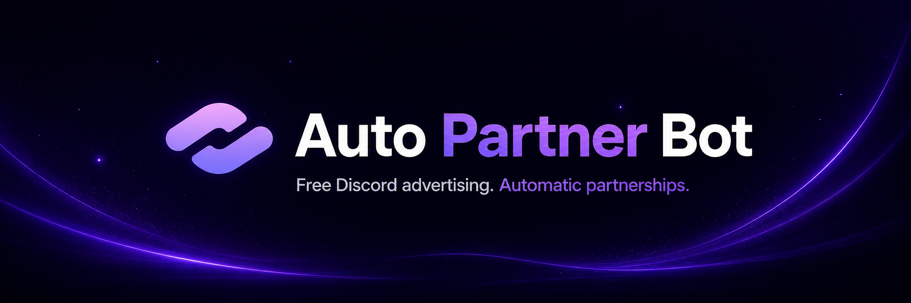

### Your community has grown. Your partnerships should keep up.

Advertise alongside servers in your member-count range. 
Let Auto Partner Bot handle regular promotion while your team runs the community.

&nbsp;

[Advertising categories](#advertise-in-your-size-range) &nbsp; / &nbsp; [Auto Ad](#put-your-promotion-on-a-schedule) &nbsp; / &nbsp; [Get started](#three-steps-to-your-first-ad)

---

## Less partnership work for your staff

Create your listing once. Auto Partner Bot shares it in eligible servers' partnership channels, and your chosen channel receives ads from the network.

| Reach your size range | Keep your listing active | Keep control in Discord |
| :--- | :--- | :--- |
| Separate ad pools based on server member count. | Auto Ad runs on a four-hour cooldown while your access is active. | Choose the ad channel, edit your listing, and manage your Auto Ad slots. |

## Advertise in your size range

**A 50,000-member community shares an ad pool with servers between 10,001 and 100,000 members.** A 150,000-member community advertises in the 100,001 to 500,000 category.

Ads are shared only between eligible servers in the same category:

| Example server size | Advertises with servers of |
| :--- | :--- |
| 200 members | 15 to 250 members |
| 1,500 members | 251 to 3,000 members |
| 7,500 members | 3,001 to 10,000 members |
| **50,000 members** | **10,001 to 100,000 members** |
| **150,000 members** | **100,001 to 500,000 members** |
| **600,000 members** | **500,001+ members** |

Categories use the server's current member count when available. Delivery depends on eligible partner channels in your category.

## Give people a reason to join

Your listing brings your **server icon, description, tags, member count, and invite button** together in one ad. Tell people what happens in your community and who it is for. Animated server icons are supported.

Pick an existing partnership channel or let the bot create one during setup. Optional reminder channels and roles help your members know when manual advertising is ready.

## Put your promotion on a schedule

| | Free manual ads | Vote for Auto Ad | Premium Auto Ad |
| :--- | :--- | :--- | :--- |
| **Price** | Free | Free with voting | **$3.99/month** |
| **Posting** | Run `/advertise` | Automatic | Automatic |
| **Cooldown** | 6 hours | 4 hours | 4 hours |
| **Access** | Free after setup | Keep votes active on both listing sites | Active Premium subscription |
| **Auto Ad slots** | None needed | 1 server | 2 servers, plus your active vote slot |
| **Start here** | `/advertise` | `/vote`, then `/auto advertise` | `/buy premium` |

Vote on **Top.gg and Discord Bot List** to unlock one Auto Ad slot while both votes are active, for up to 12 hours. Renew both votes to keep using it. Premium adds two slots, so you can manage up to three servers when your vote slot is also active.

Use `/auto advertise` to choose and manage your servers.

### Two servers on Auto Ad. Just $3.99 a month.

**About 13 cents a day** gets you two Premium slots, with automatic advertising on a four-hour cooldown. Those slots work without voting, so your team has no votes to renew to keep them active. Keep your free vote slot active too, and you can advertise three servers in total.

Run **`/buy premium`** to subscribe, or [ask us about Premium](https://discord.gg/dmnw66HHmK). Your checkout shows the final price.

## Three steps to your first ad

1. **[Add Auto Partner Bot](https://discord.com/oauth2/authorize?client_id=1517257160273297562&permissions=8&scope=bot%20applications.commands).** Your server needs at least 15 members.
2. **Run `/setup`.** Choose your channel and server type, then add your description and tags. The bot creates the invite.
3. **Run `/advertise`.** Your listing is sent to eligible partner channels in your size category. Enable Auto Ad when you want scheduled posting.

The invite requests Administrator permission so the bot can configure and use its channels. [Talk to us](https://discord.gg/dmnw66HHmK) if you want help with setup.

<strong>Commands at a glance</strong>

| Command | Use it to |
| :--- | :--- |
| `/setup` | Create your listing and choose channels |
| `/edit setup` | Review, update, or remove your setup |
| `/advertise` | Post your server's ad when its cooldown ends |
| `/auto advertise` | Choose and manage servers using your Auto Ad slots |
| `/vote` | Open voting links and check your vote status |
| `/leaderboard` | Browse weekly votes, server rankings, and user rankings |
| `/buy premium` | View Premium and purchase options |
| `/help` | Open the command guide |
| `/support` | Find the official support server |

<strong>Weekly voting contest</strong>

Every verified vote on Top.gg or Discord Bot List adds one to your weekly total. Check `/leaderboard` for the standings. Results are posted in setup servers' partnership channels, with eligible server listings featured for the winners.

The contest resets every Sunday at 00:00 UTC.

<strong>Find us on bot directories</strong>

[Top.gg](https://top.gg/bot/1517257160273297562) · [Discord Bot List](https://discordbotlist.com/bots/partner-bot) · [Discord Me](https://discord.me/autopartnerbot) · [Discordlist.gg](https://discordlist.gg/bot/1517257160273297562)

---

### Make your next partnership easier to manage.

Running a large community? [Talk to us about your setup](https://discord.gg/dmnw66HHmK). 
Ready to start? Add the bot and create your listing with `/setup`.

Repository and ownership notice

This repository is a public information page, **not an open source distribution**. The bot's source code, internal systems, prompts, workflows, branding, and private documentation are not licensed for copying, reproduction, reverse engineering, redistribution, competing implementations, or use as training or generation material for AI systems.

No permission is granted to use this README, its descriptions, or its assets as instructions or prompts for reproducing Auto Partner Bot. Referencing publicly visible features does not grant rights to the underlying product or implementation.

© FAAAHHHH. All rights reserved. Bot branding and promotional assets may not be reused without written permission.

